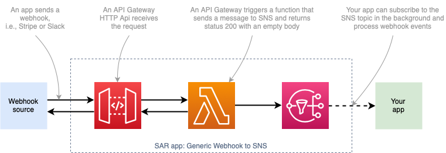

# Generic webhook to SNS topic

This project is a serverless application that receives a webhook via POST or GET HTTP method, sends the raw received data to the SNS topic, and replies with the `200 OK` response to the webhook sender.

The architecture for this app looks like the following diagram:




This app contains the following components:

1. _An API Gateway HTTP API endpoint_ -  a new API Gateway HTTP API is cheaper and less powerful than the REST API, but it has everything we need for the common webhook.
2. _A Lambda Function_ - that we use to process the request, send it to the SNS topic, and immediately return the `200 OK` response to the API Gateway.
3. _An SNS topic_ - that webhook events are sent to, you can connect rest of your application to this webhook.

## Deploy and use the application

You can deploy this app from Serverless Application Repository (SAR) or manually, using the Serverless Application Model Command Line Interface (SAM CLI).

### Install from SAR

TBA

### Install manually using 

The SAM CLI is an extension of the AWS CLI that adds functionality for building and testing Lambda applications. It uses Docker to run your functions in an Amazon Linux environment that matches Lambda. It can also emulate your application's build environment and API.

To use the SAM CLI, you need the following tools.

* SAM CLI - [Install the SAM CLI](https://docs.aws.amazon.com/serverless-application-model/latest/developerguide/serverless-sam-cli-install.html)
* Node.js - [Install Node.js 10](https://nodejs.org/en/), including the NPM package management tool.
* Docker - [Install Docker community edition](https://hub.docker.com/search/?type=edition&offering=community)

To build and deploy your application for the first time, run the following in your shell:

```bash
yarn run build
sam deploy --guided
```

The first command will build the source of your application. The second command will package and deploy your application to AWS, with a series of prompts.

You can find your API Gateway Endpoint URL in the output values displayed after deployment.

### Use with SAM

You can use Generic webhook to SNS topic application in your SAM application by adding it as a nested app in your SAM template.

A minimal template can look similar to the following one:

```yaml
AWSTemplateFormatVersion: '2010-09-09'
Transform: AWS::Serverless-2016-10-31
Description: A cool SAM app
  
Globals:
  Function:
    Timeout: 10
    Runtime: nodejs12.x

Resources:
  Webhook:
    Type: AWS::Serverless::Application
    Properties:
      Location:
        ApplicationId: arn:aws:serverlessrepo:eu-central-1:123456789012:applications/generic-webhook-to-sns
        SemanticVersion: 1.0.0

  WebhookFunction:
    Type: AWS::Serverless::Function
    Properties:
      CodeUri: build/webhook
      Handler: lambda.handler
      Events:
        WebhookEventNotification:
          Type: SNS
          Properties:
            Topic: !GetAtt Webhook.Outputs.WebhookTopicArn

Outputs:
  WebhookUrl:
    Description: "Webhook URL"
    Value: !GetAtt Webhook.Outputs.WebhookApiUrl
```


This will deploy the Webhook app from SAR and a Lambda function that will be triggered when a webhook event is received.

Important parts of the template:

- `Webhook (AWS::Serverless::Application)` is a resource that deploys a Generic webhook to SNS topic app from SAR
- `ApplicationId: arn:aws:serverlessrepo:eu-central-1:123456789012:applications/generic-webhook-to-sns` is a SAR app ARN (see the [Install from SAR](#install-from-sar) section).
- `Topic: !GetAtt Webhook.Outputs.WebhookTopicArn` get's a `WebhookTopicArn` output attribute from the SAR app.

In production, you should consider adding a few more things, such as:

- Lambda destinations or dead letter queue for handling errors
- Enable monitoring (i.e., Amazon X-Ray)
- Assigning a custom domain/path to your webhook

### Event structure

An SNS notification sent by the application will have the following properties:

- _Message_: A stringified [API Gateway HTTP API event](https://docs.aws.amazon.com/apigateway/latest/developerguide/set-up-lambda-proxy-integrations.html#api-gateway-simple-proxy-for-lambda-input-format).
- _MessageAttributes_: An SNS notification will optionally contain the following Message Attribute (used for filtering):
  - _MessageType_: An attribute that contains the the string value you can filter by. For example, for Stripe "invoice.upcoming" event, you'll receive the following Message Attributes: `{MessageType: { DataType: 'String', StringValue: 'invoice.upcoming'}`.

## License

MIT, see [LICENSE](./LICENSE).